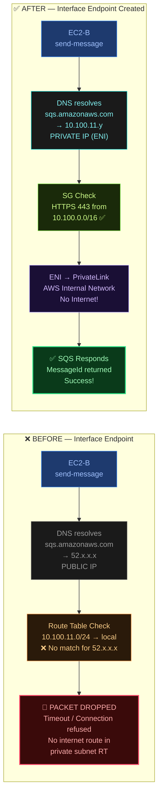
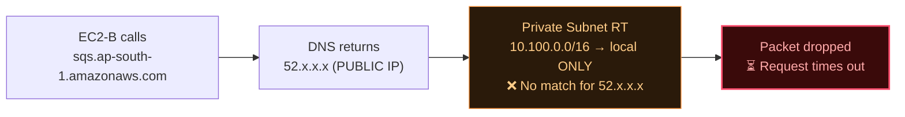
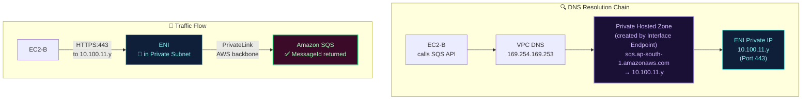
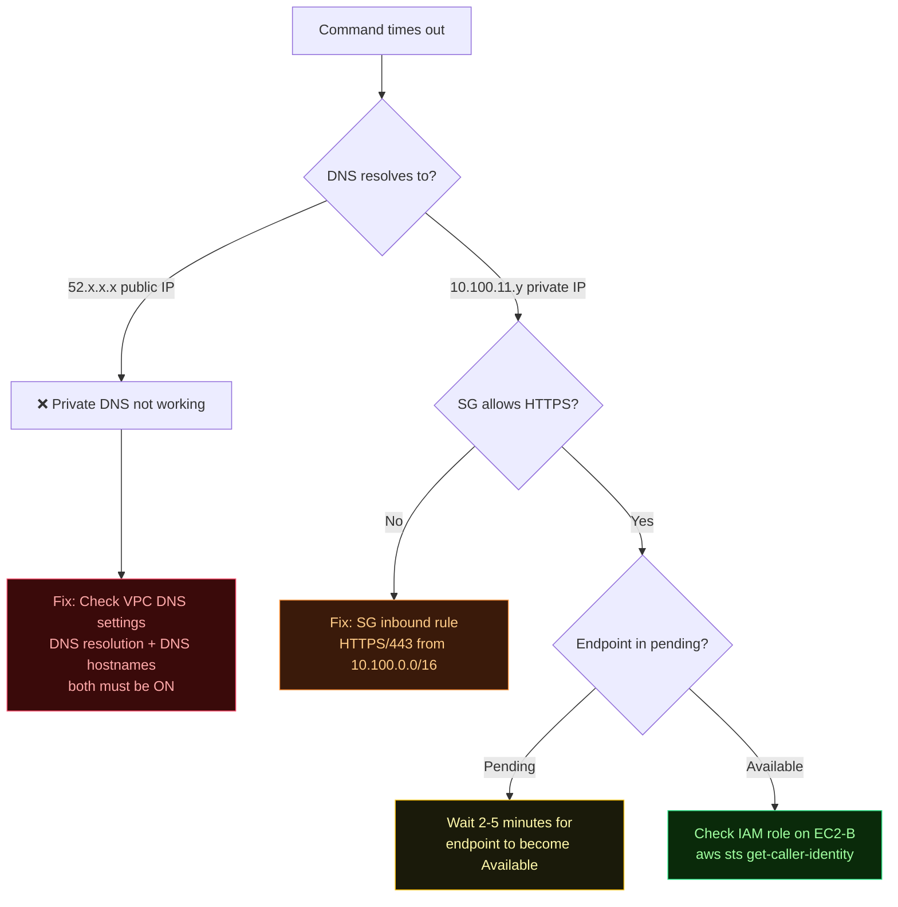
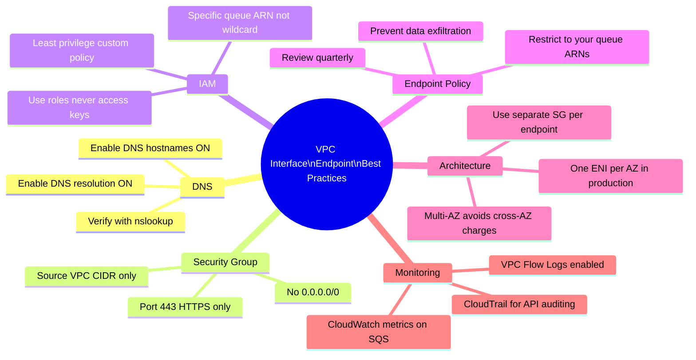
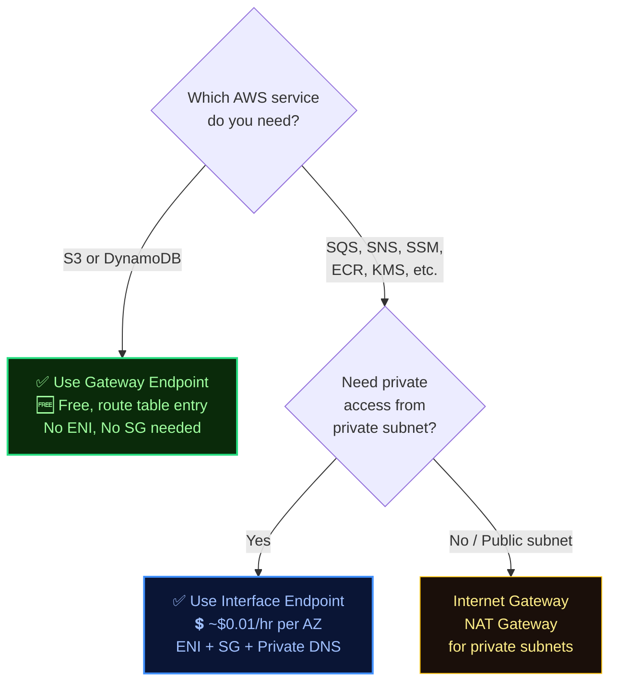

<div align="center">


# 🔌 VPC Interface Endpoint for SQS — PrivateLink Deep Dive

[](https://aws.amazon.com/)
[](#)
[](#)
[](#)
[](#)

> **Allow EC2 instances in private subnets to send/receive SQS messages — without internet access, NAT Gateway, or public IP addresses. AWS PrivateLink injects an ENI directly into your subnet, and Private DNS silently redirects all SQS API calls to that private IP.**

[](#)
[](#)
[](#)
[](#)
[-purple?style=flat-square)](#)

</div>

---

## 📐 Full Architecture — After Interface Endpoint Setup

```mermaid
flowchart TB
    User["🖥️ Your Laptop\n🌐 Internet"] -->|"🔐 SSH via Public IP"| IGW

    IGW["🌍 Internet Gateway\n🟢 VPC-A-IGW"]

    IGW --> EC2A

    subgraph REGION ["☁️ AWS Region · ap-south-1"]
        subgraph VPC ["🌐 VPC-A · 10.100.0.0/16 · Mumbai"]

            subgraph PUB ["🔓 Public Subnet · 10.100.0.0/24 · ap-south-1a"]
                EC2A["🟢 EC2-A\nBastion Host\nPublic IP + Private IP\n10.100.0.x"]
            end

            subgraph PRIV ["🔒 Private Subnet · 10.100.11.0/24 · ap-south-1a"]
                EC2B["📦 EC2-B\nPrivate IP only\n10.100.11.x\n🛡️ IAM: SQS Role"]
                ENI["🔌 ENI\nPrivate IP: 10.100.11.y\nPort 443 / HTTPS\n▶ Injected by PrivateLink"]
            end

            SG["🛡️ SG_FOR_VPC_INTERFACE_ENDPOINT\nInbound: HTTPS/443 ← 10.100.0.0/16\nOutbound: All traffic"]
            VPCE["⚡ VPC Interface Endpoint\ncom.amazonaws.ap-south-1.sqs\nType: Interface · vpce-xxxxxxxxxx\nPrivate DNS: ✅ Enabled"]
        end

        PL["🔐 AWS PrivateLink\n━━━━━━━━━━━━━\nAWS Internal Backbone\nNo Public Internet"]
        SQS["📨 Amazon SQS\nmy-queue\nhttps://sqs.ap-south-1.\namazonaws.com/xxx/my-queue"]
    end

    EC2A -->|"🚪 SSH hop\nPrivate IP"| EC2B
    EC2B -->|"① DNS lookup\nsqs.ap-south-1.amazonaws.com\n→ resolves to 10.100.11.y\n(ENI Private IP!)"| ENI
    ENI -->|"② HTTPS:443\nSame subnet traffic"| PL
    PL -->|"③ AWS backbone\nNo internet"| SQS
    SQS -.->|"④ Response via\nsame path"| EC2B

    SG -.->|"🔒 Controls access to"| ENI
    VPCE -.->|"Creates & manages"| ENI

    style User fill:#1a3a5c,stroke:#4090ff,stroke-width:2px,color:#a0c8ff
    style IGW fill:#1a0f35,stroke:#B19FFF,stroke-width:2px,color:#d0b8ff
    style EC2A fill:#1e4a20,stroke:#26de81,stroke-width:2px,color:#a0ffb8
    style EC2B fill:#1e3a6e,stroke:#4090FF,stroke-width:2px,color:#a0c0ff
    style ENI fill:#2d1860,stroke:#B19FFF,stroke-width:2px,color:#d0b8ff
    style SG fill:#3a1a0a,stroke:#FF9843,stroke-width:1px,stroke-dasharray:4 3,color:#ffcc88
    style VPCE fill:#0f1f3a,stroke:#00d2d3,stroke-width:2px,color:#80f0f1
    style PL fill:#1a0f2a,stroke:#B19FFF,stroke-width:3px,color:#e0d0ff
    style SQS fill:#3a0a28,stroke:#FF4F8B,stroke-width:3px,color:#ffaad0
    style VPC fill:#060e1c,stroke:#4090FF,stroke-width:2px,stroke-dasharray:5 3
    style PUB fill:#0a1f0e,stroke:#26de81,stroke-width:1px,stroke-dasharray:4 3
    style PRIV fill:#0a1228,stroke:#4090FF,stroke-width:1px,stroke-dasharray:4 3
    style REGION fill:#08101a,stroke:#2a4060,stroke-width:1px,stroke-dasharray:8 5
```



---

## ⚡ The "DNS Magic" — How Interface Endpoints Work

> This is the most important concept. Unlike Gateway Endpoints (which use route table entries), Interface Endpoints work via **DNS interception**. Understanding this is key.

```mermaid
sequenceDiagram
    autonumber
    participant EC2B as 🖥️ EC2-B<br/>10.100.11.5
    participant DNS as 🔍 VPC DNS Resolver<br/>169.254.169.253
    participant ENI as 🔌 ENI<br/>10.100.11.y (Private IP)
    participant PL as 🔐 AWS PrivateLink
    participant SQS as 📨 Amazon SQS

    rect rgb(15, 25, 50)
        Note over EC2B,SQS: ✅ WITH Interface Endpoint + Private DNS Enabled
        EC2B->>DNS: Resolve sqs.ap-south-1.amazonaws.com
        DNS-->>EC2B: Returns 10.100.11.y (ENI Private IP!)
        EC2B->>ENI: HTTPS request → 10.100.11.y:443
        ENI->>PL: Forwards via PrivateLink
        PL->>SQS: Reaches SQS via AWS internal backbone
        SQS-->>EC2B: ✅ MessageId returned
    end

    rect rgb(40, 15, 15)
        Note over EC2B,SQS: ❌ WITHOUT Interface Endpoint (or Private DNS disabled)
        EC2B->>DNS: Resolve sqs.ap-south-1.amazonaws.com
        DNS-->>EC2B: Returns 52.x.x.x (Public IP!)
        EC2B->>EC2B: Checks route table → No route to 52.x.x.x
        EC2B->>EC2B: ❌ Packet dropped — no internet route
    end
```



---

## 🔄 Before vs After — Traffic Flow Comparison



---

## 🆚 Interface Endpoint vs Gateway Endpoint — Critical Differences

```mermaid
flowchart LR
    subgraph GW ["🟢 Gateway Endpoint (S3 / DynamoDB)"]
        direction TB
        G1["EC2-B"] --> G2["Route Table\npl-xxxxxx → vpce-xxxx\nPacket routing"]
        G2 --> G3["AWS Internal\nNo ENI, No SG\n🆓 FREE"]
        style GW fill:#0a1f0a,stroke:#26de81,stroke-width:2px
        style G3 fill:#0a2a0a,stroke:#26de81,stroke-width:1px,color:#a0ffa0
    end

    subgraph IF ["🔵 Interface Endpoint (SQS, SNS, most services)"]
        direction TB
        I1["EC2-B"] --> I2["DNS resolves to\nENI Private IP\nApplication routing"]
        I2 --> I3["ENI in your subnet\nSecurity Group required\n💲 ~$0.01/hr/AZ"]
        style IF fill:#0a0f2a,stroke:#4090FF,stroke-width:2px
        style I3 fill:#0a1535,stroke:#4090FF,stroke-width:1px,color:#a0c0ff
    end
```



| Feature | 🟢 Gateway Endpoint | 🔵 Interface Endpoint |
|---------|--------------------|-----------------------|
| **Supported Services** | S3, DynamoDB only | SQS, SNS, SSM, ECR, KMS, and 100+ more |
| **Routing Mechanism** | Route table prefix list | ENI private IP + Private DNS |
| **Network Interface** | None — no ENI created | ✅ ENI injected in your subnet |
| **Security Group** | Not applicable | ✅ Required on the ENI |
| **Private DNS** | Not needed | ✅ Must enable on VPC |
| **Cost** | 🆓 **Free** | 💲 ~$0.01/hr per AZ + $0.01/GB data |
| **Routing control** | Route table entry | DNS (application-level) |
| **Cross-region access** | ❌ No | ❌ No (same region only) |
| **When to use** | S3 / DynamoDB from private subnets | Any other AWS service privately |

> 💡 **Industry Rule:** Use Gateway Endpoint for S3/DynamoDB (free). Use Interface Endpoint for everything else that needs private access.

---

## 🏗️ Architecture Summary

```
Your Laptop
    │  SSH (public internet)
    ▼
Internet Gateway (IGW)
    │
    ▼  ┌──────────────────── AWS Region: ap-south-1 ───────────────────────────────────┐
       │                                                                               │
       │  VPC-A  (10.100.0.0/16)  [DNS hostnames: ✅ ON  |  DNS resolution: ✅ ON]    │ 
       │  ┌────────────────────────────────────-────┐                                  │
       │  │  Public Subnet  10.100.0.0/24           │                                  │
       │  │  ┌──────────────────────────────────┐   │                                  │
       │  │  │  EC2-A  │  Public + Private IP   │   │                                  │
       │  │  │  (Bastion host)                  │   │                                  │
       │  │  └──────────────────────────────────┘   │                                  │
       │  │            │ SSH                        │                                  │
       │  │  Private Subnet  10.100.11.0/24         │                                  │
       │  │  ┌──────────────────────────────────┐   │                                  │
       │  │  │  EC2-B  │  Private IP only       │   │                                  │
       │  │  │  IAM Role: SQS access attached   │   │                                  │
       │  │  └──────────────────────────────────┘   │                                  │
       │  │       │  HTTPS:443 to ENI Private IP    │                                  │
       │  │  ┌──────────────────────────────────┐   │                                  │
       │  │  │  ENI (10.100.11.y)               │   │                                  │
       │  │  │  SG: HTTPS/443 from VPC CIDR     │───┼──► PrivateLink ──► Amazon SQS    │
       │  │  │  (VPC Interface Endpoint)        │   │    (AWS backbone)                │
       │  │  └──────────────────────────────────┘   │                                  │
       │  └──────────────────────────────────────-──┘                                  │
       └───────────────────────────────────────────────────────────────────────────────┘
```

---

## 📋 Step-by-Step Implementation

### Step 0 — Enable Private DNS on VPC-A

> **⚠️ CRITICAL — Do this first!** Without this, the SQS hostname resolves to a public IP even after creating the endpoint.

1. VPC Console → **Your VPCs** → select **VPC-A**
2. **Actions → Edit VPC settings**
3. Enable: ✅ **DNS resolution**
4. Enable: ✅ **DNS hostnames**
5. Save

```
Without Private DNS:  sqs.ap-south-1.amazonaws.com → 52.x.x.x  (PUBLIC IP)  ❌
With Private DNS:     sqs.ap-south-1.amazonaws.com → 10.100.11.y (ENI IP)   ✅
```

> 🏆 **Industry Best Practice — Always Enable Both DNS Settings**
> DNS resolution and DNS hostnames must both be ON for Private DNS on Interface Endpoints to work. This is the #1 reason Interface Endpoints fail in new setups. Set it at VPC creation time as a standard.

---

### Step 1 — Create SQS Standard Queue

```
SQS Console → Create queue
```

| Field | Value |
|-------|-------|
| Type | **Standard** |
| Name | `my-queue` |
| Visibility timeout | 30 seconds (default) |
| Message retention period | 4 days (default) |
| Region | `ap-south-1` ← same as VPC! |

After creation, **copy the Queue URL**:
```
https://sqs.ap-south-1.amazonaws.com/123456789012/my-queue
```

> **Important:** SQS queue must be in the **same region** as your VPC and Interface Endpoint.

---

### Step 2 — Create IAM Role for EC2-B

EC2-B needs permission to send messages to SQS.

#### Create the role
| Step | Action |
|------|--------|
| 1 | IAM Console → Roles → **Create role** |
| 2 | Trusted entity: **AWS service → EC2** |
| 3 | Permission policy: search and select **`AmazonSQSFullAccess`** |
| 4 | Role name: **`EC2_ROLE_FOR_SQS`** |
| 5 | Create role |

#### Attach role to EC2-B
1. EC2 Console → select **EC2-B**
2. Actions → Security → **Modify IAM role**
3. Select `EC2_ROLE_FOR_SQS` → **Update IAM role**

> 🏆 **Industry Best Practice — Scope Down from `AmazonSQSFullAccess`**
> `AmazonSQSFullAccess` is too broad for production. Create a custom policy that allows only the actions your application needs. For a producer: `sqs:SendMessage` on your specific queue ARN. For a consumer: `sqs:ReceiveMessage`, `sqs:DeleteMessage`. This follows **least privilege principle** — a core AWS Well-Architected Framework pillar.

```json
{
  "Version": "2012-10-17",
  "Statement": [
    {
      "Sid": "MinimalSQSProducerPolicy",
      "Effect": "Allow",
      "Action": [
        "sqs:SendMessage",
        "sqs:GetQueueAttributes"
      ],
      "Resource": "arn:aws:s3:::ap-south-1:123456789012:my-queue"
    }
  ]
}
```

---

### Step 3 — Test SQS Access (Will Fail)

SSH chain to EC2-B, then try to send a message:

```bash
# Step 1: SSH to EC2-A from your laptop
ssh -i my-key.pem ec2-user@<EC2-A-Public-IP>

# Step 2: From EC2-A, SSH to EC2-B
ssh -i ~/.ssh/my-key.pem ec2-user@10.100.11.<x>

# Step 3: From EC2-B, try to send to SQS
aws sqs send-message \
  --queue-url https://sqs.ap-south-1.amazonaws.com/123456789012/my-queue \
  --message-body "Test message"

# Expected result: HANGS for 30-60 seconds then:
# Could not connect to the endpoint URL:
# "https://sqs.ap-south-1.amazonaws.com/"
# OR: connection timeout
```

**Why does this fail?**



---

### Step 4 — Create VPC Interface Endpoint for SQS

This is a two-part process: first create the Security Group, then create the endpoint.

#### Part A — Create the Security Group for the Endpoint ENI

```
VPC Console → Security Groups → Create security group
```

| Field | Value |
|-------|-------|
| Security group name | `SG_FOR_VPC_INTERFACE_ENDPOINT` |
| Description | `Allows HTTPS from VPC for SQS interface endpoint` |
| VPC | `VPC-A` |

**Inbound rules:**

| Type | Protocol | Port | Source | Why |
|------|----------|------|--------|-----|
| HTTPS | TCP | **443** | `10.100.0.0/16` | Allow VPC traffic to reach ENI |

**Outbound rules:** Leave as default (All traffic allowed)

> 🏆 **Industry Best Practice — Restrict ENI Security Group to VPC CIDR**
> Do not use `0.0.0.0/0` as source on the endpoint's SG. Scope it to your VPC CIDR (`10.100.0.0/16`) or even more tightly to the specific subnet (`10.100.11.0/24`) where EC2-B lives. This limits which resources can reach the ENI.

#### Part B — Create the Interface Endpoint

```
VPC Console → Endpoints → Create endpoint
```

| Field | Value |
|-------|-------|
| Name tag | `my-sqs-endpoint` |
| Service category | AWS services |
| Service name | **`com.amazonaws.ap-south-1.sqs`** |
| Type | **Interface** ← not Gateway! |
| VPC | `VPC-A` |
| Subnets | `ap-south-1a` → select **VPC-A-Private-Subnet** |
| Enable DNS name | ✅ **Enabled** (Private DNS) |
| Security groups | `SG_FOR_VPC_INTERFACE_ENDPOINT` |

Click **Create endpoint**

> **What AWS does behind the scenes:**
> 1. Creates an **ENI** (Elastic Network Interface) in your private subnet with a private IP (e.g., `10.100.11.y`)
> 2. Creates a **private hosted zone** in Route 53 for `sqs.ap-south-1.amazonaws.com`
> 3. The private hosted zone overrides the public DNS record — `sqs.ap-south-1.amazonaws.com` now resolves to `10.100.11.y` within your VPC

---

### Step 5 — Verify SQS Access (Should Work Now)

```bash
# From EC2-B terminal (same SSH session)
aws sqs send-message \
  --queue-url https://sqs.ap-south-1.amazonaws.com/123456789012/my-queue \
  --message-body "Test message via Interface Endpoint"

# ✅ Expected output:
{
    "MD5OfMessageBody": "82dfa5549ebc9afc168eb7931ebece5f",
    "MessageId": "xxxxxxxx-xxxx-xxxx-xxxx-xxxxxxxxxxxx"
}

# Verify message is in queue (from SQS console or via CLI)
aws sqs receive-message \
  --queue-url https://sqs.ap-south-1.amazonaws.com/123456789012/my-queue

# Verify DNS resolution (should return private IP now!)
nslookup sqs.ap-south-1.amazonaws.com
# Should return: 10.100.11.y  ← ENI private IP
# NOT: 52.x.x.x (public IP)

# Check your IAM identity
aws sts get-caller-identity
```

**What changed — the full picture:**



---

## 🔐 Security Best Practices

### 1 · Endpoint Policy — Restrict Which Queues Are Accessible

By default the endpoint allows access to **all SQS queues** in the region. Lock it down:

```json
{
  "Version": "2012-10-17",
  "Statement": [
    {
      "Sid": "AllowOnlyMyQueue",
      "Principal": "*",
      "Effect": "Allow",
      "Action": [
        "sqs:SendMessage",
        "sqs:ReceiveMessage",
        "sqs:DeleteMessage"
      ],
      "Resource": "arn:aws:sqs:ap-south-1:123456789012:my-queue"
    }
  ]
}
```

> 🏆 **Industry Best Practice:** Endpoint policies are your last line of defense against data exfiltration. An attacker who compromises an EC2 instance could use the interface endpoint to access queues in other accounts. Restrict to your specific resource ARNs.

### 2 · SQS Queue Policy — Only Allow from Your VPC

Add a resource-based policy to the queue itself:

```json
{
  "Version": "2012-10-17",
  "Statement": [
    {
      "Sid": "DenyNonVPCEndpointAccess",
      "Effect": "Deny",
      "Principal": "*",
      "Action": "sqs:*",
      "Resource": "arn:aws:sqs:ap-south-1:123456789012:my-queue",
      "Condition": {
        "StringNotEquals": {
          "aws:sourceVpce": "vpce-xxxxxxxxxx"
        }
      }
    }
  ]
}
```

### 3 · Enable VPC Flow Logs

Monitor all traffic to and from the ENI:

```bash
# Enable flow logs on VPC-A
aws ec2 create-flow-logs \
  --resource-type VPC \
  --resource-ids vpc-xxxxxxxxxx \
  --traffic-type ALL \
  --log-destination-type cloud-watch-logs \
  --log-group-name /vpc/flow-logs
```

> 🏆 **Industry Best Practice:** VPC Flow Logs on the private subnet help audit which EC2 instances are reaching the SQS endpoint ENI. Essential for compliance (SOC 2, PCI-DSS, HIPAA) and incident response.

### 4 · Use Multi-AZ Endpoints for Production

> 🏆 **Industry Best Practice — Deploy Endpoints in Every AZ**
> In production, create the Interface Endpoint in **every AZ where your EC2 instances run**. If the endpoint's ENI is in ap-south-1a and your EC2 is in ap-south-1b, traffic crosses AZ boundaries — incurring data transfer cost and adding latency. One ENI per AZ = best performance and no cross-AZ charges.

```
Dev setup (this exercise):  1 subnet → 1 ENI → ap-south-1a only
Production setup:           3 subnets → 3 ENIs → ap-south-1a, ap-south-1b, ap-south-1c
```

---

## 🔧 Troubleshooting

### `aws sqs send-message` still times out after creating endpoint



**Quick diagnostic commands from EC2-B:**

```bash
# 1. Check DNS resolution — MOST IMPORTANT
nslookup sqs.ap-south-1.amazonaws.com
# ✅ Should return: 10.100.11.y (private IP)
# ❌ If returns 52.x.x.x: Private DNS is not working

# 2. Check IAM credentials
aws sts get-caller-identity
# Should show: arn:aws:sts::xxxxx:assumed-role/EC2_ROLE_FOR_SQS/...

# 3. Test HTTPS connectivity to ENI
curl -v https://sqs.ap-south-1.amazonaws.com
# ✅ Should get SSL handshake (even if it returns 403)
# ❌ Connection refused / timeout = SG issue

# 4. Check endpoint status
aws ec2 describe-vpc-endpoints \
  --filters Name=service-name,Values=com.amazonaws.ap-south-1.sqs \
  --query 'VpcEndpoints[].State'
# Should return: "available"

# 5. Set region if needed
aws configure set region ap-south-1
```

---

### Common Failures Table

| Symptom | Root Cause | Fix |
|---------|-----------|-----|
| Command times out, DNS → public IP | Private DNS not working | Enable DNS hostnames + resolution on VPC |
| Command times out, DNS → private IP | Security Group blocks HTTPS | Add inbound HTTPS/443 from VPC CIDR to SG |
| `UnauthorizedOperation` error | IAM role missing SQS permissions | Attach `EC2_ROLE_FOR_SQS` to EC2-B |
| `Access Denied` from SQS | Endpoint policy too restrictive | Update endpoint policy resource ARN |
| `QueueDoesNotExist` | Wrong queue URL or region | Verify queue exists in ap-south-1 |
| DNS returns private IP but SSL fails | Wrong SG on endpoint | Check ENI's SG allows HTTPS from EC2-B subnet |
| Endpoint status: `pending` | Still being created | Wait 2-5 minutes; check in VPC → Endpoints |

---

## 🏆 Industry Best Practices — Summary Card



---

## 🆚 Key Concepts: Interface Endpoint vs Gateway Endpoint

> You've now done both exercises. Here's the mental model for choosing:



| | Gateway Endpoint | Interface Endpoint |
|---|---|---|
| **AWS Services** | S3, DynamoDB | 100+ services incl. SQS, SNS, SSM |
| **Creates ENI** | No | Yes — in your subnet |
| **Routing** | Route table prefix list | DNS (Private DNS) |
| **Security Group** | Not applicable | Required on ENI |
| **Private DNS** | Not needed | Must be enabled |
| **Cost** | 🆓 **Free** | 💲 ~$0.01/hr/AZ + data |
| **Visibility in subnet** | No private IP | Has private IP |
| **Cross-region** | No | No |
| **Typical use** | S3 downloads from EC2 | Sending to SQS, reading SSM params |

---

## 🗑️ Clean-Up

### If NOT continuing
```bash
# 1. Terminate both EC2 instances (stop billing immediately)

# 2. Delete the VPC endpoint
aws ec2 delete-vpc-endpoints --vpc-endpoint-ids vpce-xxxxxxxxxx

# 3. Delete the SQS queue (purge it first if it has messages)
aws sqs purge-queue --queue-url https://sqs.ap-south-1.amazonaws.com/xxx/my-queue
aws sqs delete-queue --queue-url https://sqs.ap-south-1.amazonaws.com/xxx/my-queue

# 4. Delete the Security Group SG_FOR_VPC_INTERFACE_ENDPOINT

# 5. Delete IAM role EC2_ROLE_FOR_SQS

# 6. Delete VPC-A (removes subnets, route tables, IGW associations)
```

### If continuing to more exercises
1. Delete VPC endpoint (`vpce-xxxxxxxxxx`) to stop hourly charges
2. Delete SQS queue if not needed
3. Keep VPC-A, EC2 instances, subnets

> 💡 **Cost reminder:** Unlike Gateway Endpoints (free), Interface Endpoints charge **~$0.01/hour per AZ** even when idle. Always delete them when the exercise is done.

---

## 📚 Key Concepts Recap

| Concept | What it is | Why it matters |
|---------|-----------|----------------|
| **Interface Endpoint** | VPC resource using ENI + PrivateLink for AWS service access | Private path to SQS without internet |
| **ENI** (Elastic Network Interface) | Virtual network card with a private IP in your subnet | The actual "entry point" packets reach |
| **AWS PrivateLink** | Technology powering Interface Endpoints, routes traffic via AWS backbone | Never touches public internet |
| **Private DNS** | Route 53 private hosted zone overriding public SQS DNS | Key magic — redirects SQS hostname to ENI IP |
| **Endpoint Security Group** | SG attached to the ENI, controls who can reach it | Allow HTTPS/443 from VPC CIDR |
| **Endpoint Policy** | IAM-style policy on the endpoint | Restrict which queues/actions are allowed |
| **`com.amazonaws.ap-south-1.sqs`** | The AWS service endpoint identifier | Used when creating the endpoint |
| **`vpce-xxxxxxxxxx`** | Your endpoint's ID | Used in bucket/queue policies for conditions |

---

<div align="center">


**Built with 🔐 AWS PrivateLink | 🔌 Interface Endpoints | 📨 Amazon SQS**

[](https://docs.aws.amazon.com/vpc/latest/privatelink/vpc-endpoints.html)
[](https://aws.amazon.com/privatelink/)

</div>
